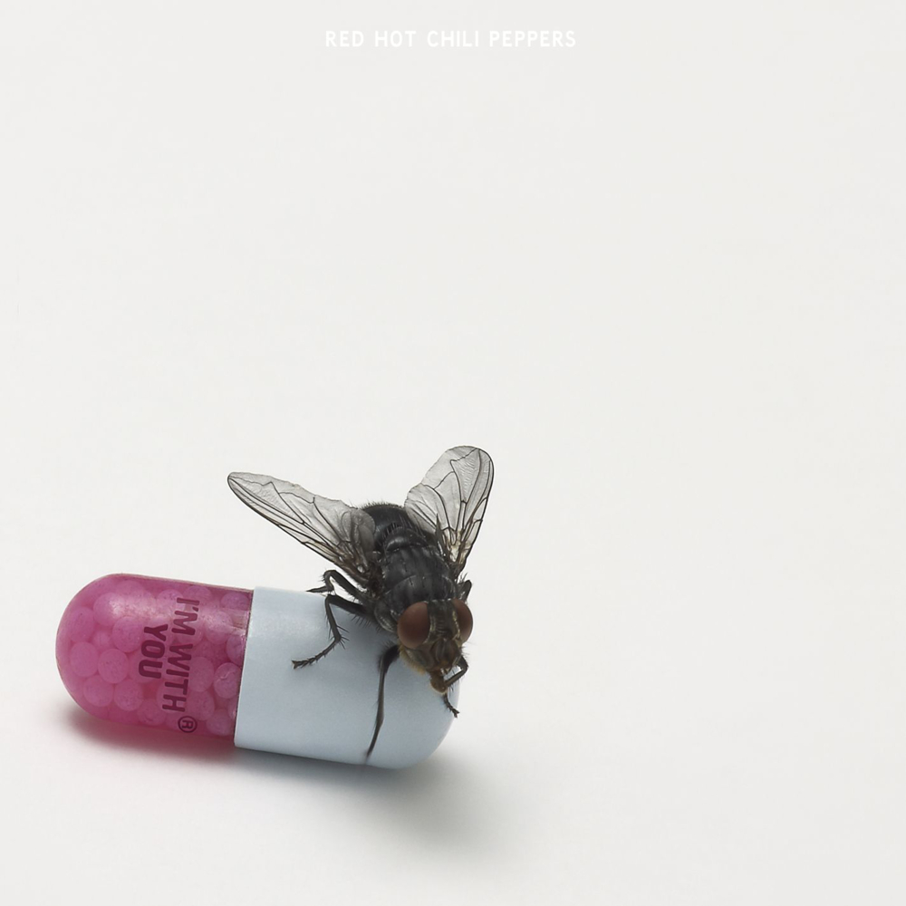
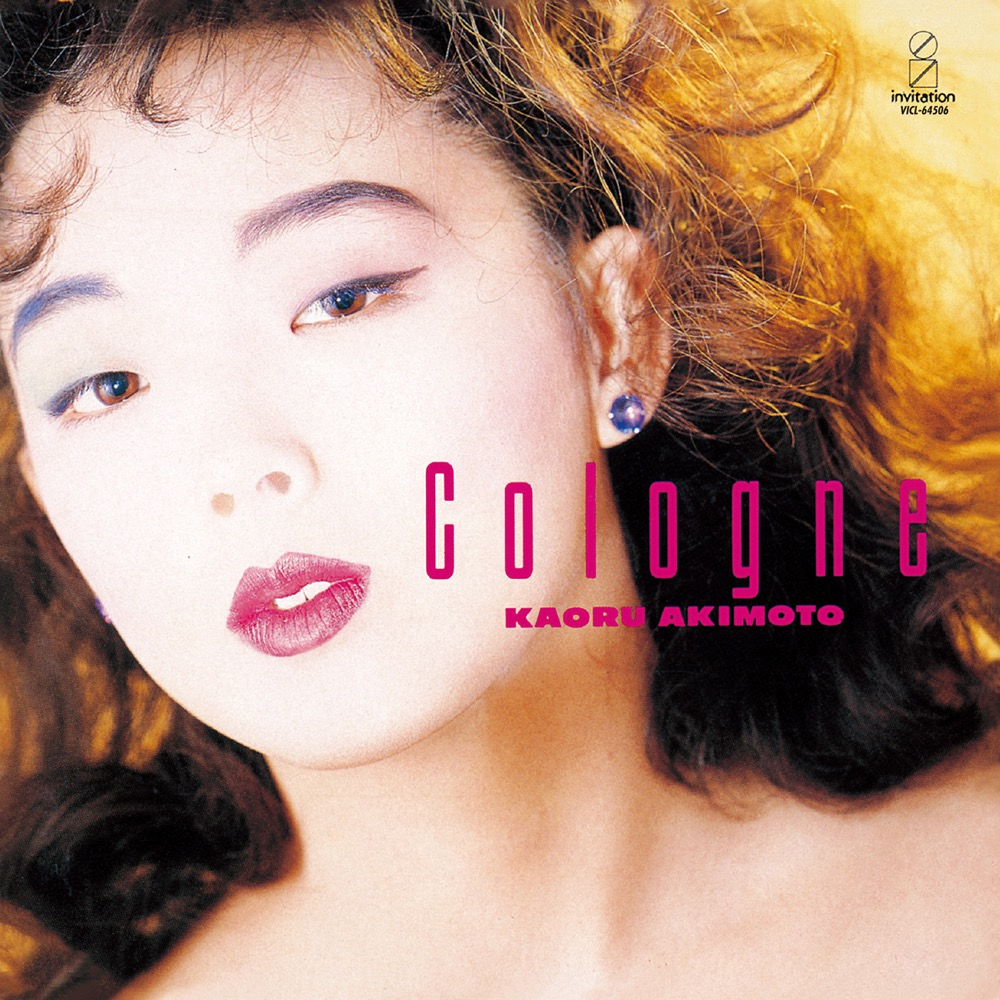
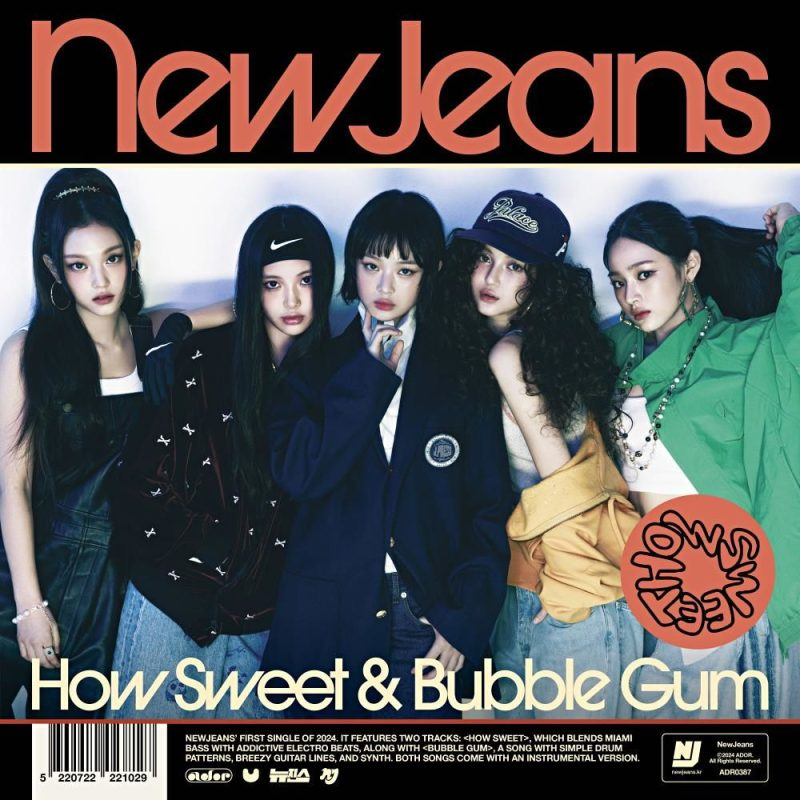
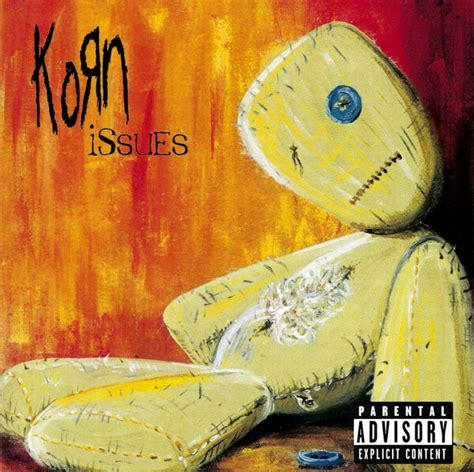

# $ cat /home/alyoksi/music

Here is a list of my most favourite albums. There is no particular order;
I've just added them as they came to my mind.

As you can see, there are albums from many different genres.

I believe that for some people, **genre is a wall** that stops them from
enjoying the music they truly want to listen to. 
Throw away all those stereotypes and just enjoy!

  <figure style="text-align: center;">
    
    <figcaption>RHCP - I'm with You</figcaption>
  </figure>
  
  <figure style="text-align: center;">
    
    <figcaption >IVE - REVIVE+</figcaption>
  </figure>
  
  <figure style="text-align: center;">
    
    <figcaption>Kaoru Akimoto - Cologne</figcaption>
  </figure>
  
  <figure style="text-align: center;">
    
    <figcaption>Minako yoshida - Let's do it</figcaption>
  </figure>
  
  <figure style="text-align: center;">
    
    <figcaption>Ghost - Impera</figcaption>
  </figure>
  
  <figure style="text-align: center;">
    
    <figcaption>C418 - Minecraft Volume Alpha</figcaption>
  </figure>
  
  <figure style="text-align: center;">
    
    <figcaption>NewJeans - How Sweet</figcaption>
  </figure>
  
  <figure style="text-align: center;">
    
    <figcaption>Korn - Issues</figcaption>
  </figure>

